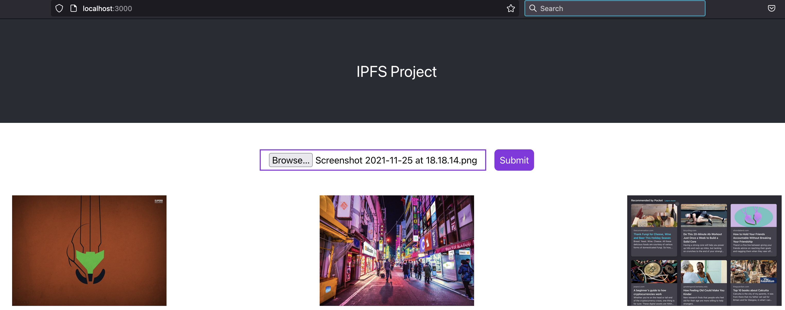

# Homework #7


1. Use one of the storage providers to store data online.
* https://ipfs.io (https://ipfs.io)
* https://nft.storage/ (https://nft.storage/)
* https://www.storj.io/ (https://www.storj.io/) (Go library)
* Any other...

I stored the data using `store_data.js` file for a simple string.

To run it:

```
$ npm i ipfs
```

```
$ node store_data.js 
Swarm listening on /ip4/127.0.0.1/tcp/4002/p2p/12D3KooWKUQrSMLwYquZq7zkGu6aRabXqniwfxvGdk9ZqkxQznWc
Swarm listening on /ip4/10.244.114.239/tcp/4002/p2p/12D3KooWKUQrSMLwYquZq7zkGu6aRabXqniwfxvGdk9ZqkxQznWc
Swarm listening on /ip4/127.0.0.1/tcp/4003/ws/p2p/12D3KooWKUQrSMLwYquZq7zkGu6aRabXqniwfxvGdk9ZqkxQznWc

Data is stored in https://ipfs.io/ipfs/QmT9FQ6spMuq2CKTnHs6271nB8Tms1MF6vggAA15W4Vwg2
```

2. Allow others to retrieve data from location.

To run it:

```
$ npm i ipfs
```

```
$ node retrieve.js 
Swarm listening on /ip4/127.0.0.1/tcp/4002/p2p/12D3KooWKUQrSMLwYquZq7zkGu6aRabXqniwfxvGdk9ZqkxQznWc
Swarm listening on /ip4/10.244.114.239/tcp/4002/p2p/12D3KooWKUQrSMLwYquZq7zkGu6aRabXqniwfxvGdk9ZqkxQznWc
Swarm listening on /ip4/127.0.0.1/tcp/4003/ws/p2p/12D3KooWKUQrSMLwYquZq7zkGu6aRabXqniwfxvGdk9ZqkxQznWc

Data stored is: FOO BAR
```

3. Create a front-end application to programmatically interact with storage provider.

There is a folder in this directory called `ipfs-proj` which is a simple website that uploads and shows the image after successful upload.



To run it, just enter on the `ipfs-proj` directory and run:

```
$ npm install

$ npm start
```

The app uses the `ipfs-http-client` library and a simple `react` app to connect to Infura's IPFS endpoint.


4. How would you try to delete data from IPFS?

There is no current way of deleting data from IPFS as described on [this github issue](https://github.com/ipfs-inactive/faq/issues/9).

One thing that can be done to mitigate this though, is that if you are hosting your website (say an static one) from IPFS, use your node to "block" some of the CID's so when you update your data you can curate what you want your users to see.

Another thing that can be done as described on the github issue is that it is possible for nodes to follow blocklists and to agree (concensus) to follow common ones.
